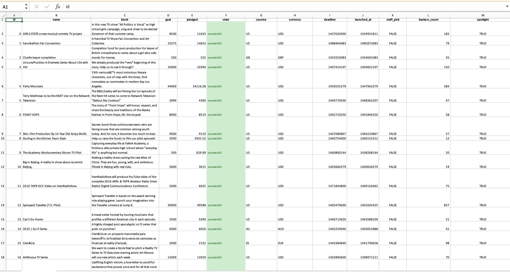
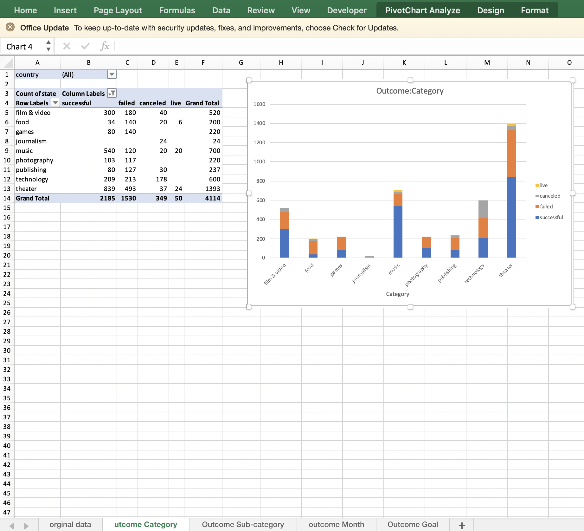
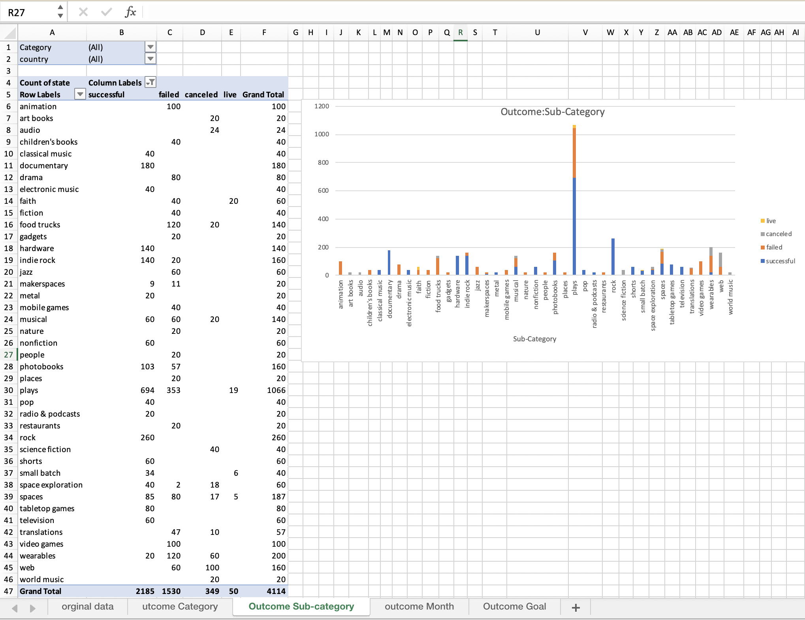
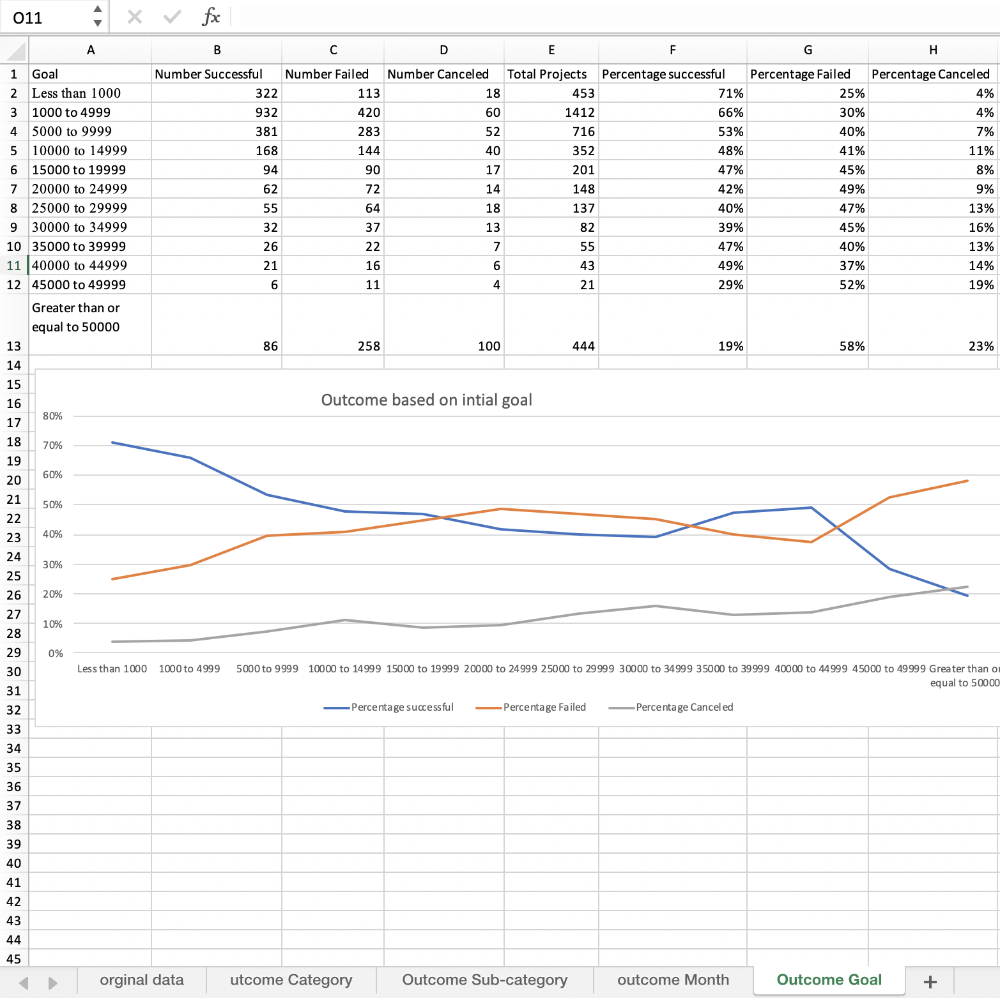

# KickStarterCampgainsAnalysis
Analysis of Kickerstarter campaigan data
Many factors go into a successful fundraising campaigan. With the data provided fundraising organizers would be able to make decsions based on what made past campgains successful. 
1.	Given the data provided several conclusions can be drawn. First, music campaigns are the most successful with about 77% of campaigns reaching their goal. In fact, multiple sub-categories of music have a 100% success rate. While there were more total successful campaigns under the “theater”, total success rate for that category was only 60%. The second conclusion that can be drawn is that food campaigns where the least successful. While sub categories such as food trucks and restaurants have a 100% fail/cancel rate, the small batch sub category shows promise however, there is not enough data to make a conclusion. The third conclusion that can be drawn based on when a campaign was started. According to the data provided, most of the successful campaigns were started in the month of May, and the least amount of successful campaigns are started in the month of December. A key factor in weather a campaign was successful in their funding campaigns was whether or not that campaigns received a “spotlight”. Campaigns that received spotlights were almost all successful. However, someone campaigns that did not receive spotlights were also successful but they were few in number. 
2.	There are some limitations to this data set. One of the limitations being that several categories have many more entries than others. The conclusions drawn based off this data could be significantly different if other categories had an equal amount of entries as others. More accurate trends would be established if there were an equal amount of data entries
3.	 There are several other tables and graphs that could be created with the data provided in order to help with better analysis. The first would be a table comparing the number of backers to the average donation amount. This would help explain if successful campaigns were funded by many small dollar donations, or if they were funded by few large dollar donations. A table can also be created to see if large/small donors were more likely to fund certain categories or sub-categories

